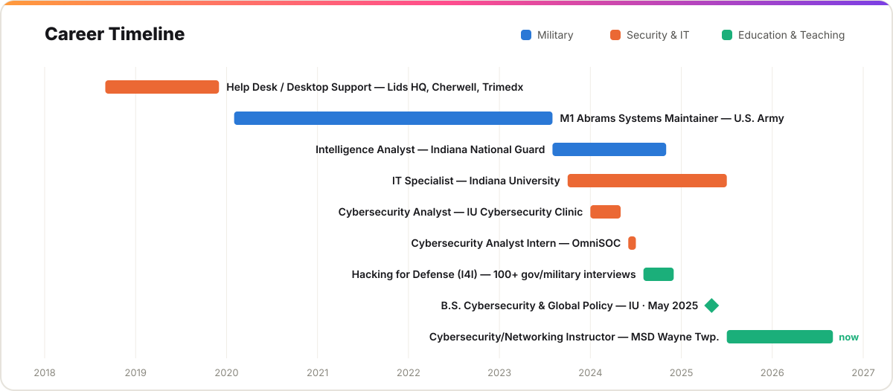
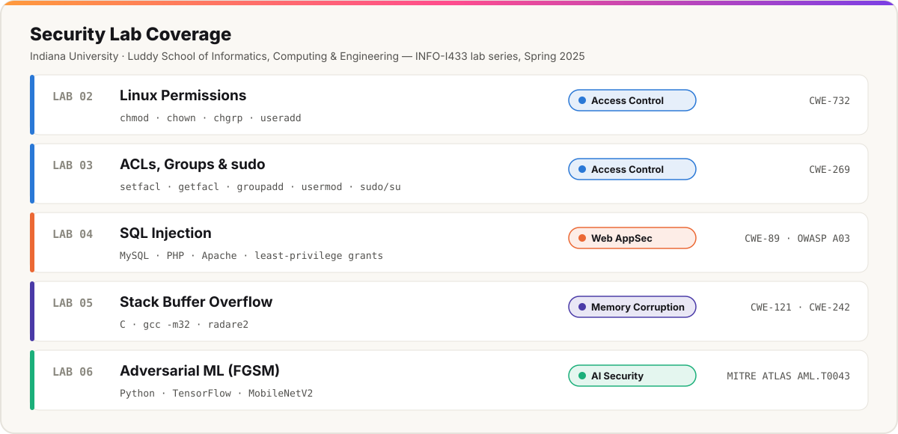

  

# Henery "Benji" Cash: Cybersecurity Analyst · U.S. Army Veteran · Security+

**SOC & Incident Response · Threat Intelligence · GRC / Risk · Security Engineering**

I spent 3½ years in the U.S. Army, then worked as an **Intelligence Analyst** in the Indiana National Guard. After that I did hands-on **SOC, incident response, and NIST/CIS risk assessment** work, and I now teach cybersecurity. I hold **CompTIA Security+**, a **B.S. in Cybersecurity & Global Policy** from Indiana University, and a **recently held U.S. security clearance**.

<table>
<tr><td>

| | |
|---|---|
| 🎯 **Target roles** | SOC Analyst · Cybersecurity Consultant · Network Analyst · Incident Response · Threat Intelligence · GRC / Cyber Risk · Security Engineer |
| 🛡️ **Clearance** | Recently held U.S. security clearance (military intelligence) |
| 📜 **Certifications** | CompTIA Security+ · [Google Cybersecurity Professional Certificate](https://coursera.org/verify/professional-cert/PCV2UJ6JGPXZ) (verified) · DHS Level 1 |
| 🎓 **Education** | B.S. Cybersecurity & Global Policy, Indiana University Bloomington (May 2025) |
| 🇺🇸 **Veteran** | U.S. Army 2020–2023 · Indiana National Guard 2023–2024 |
| 📍 **Location** | Indianapolis, IN · **Open to relocation** and remote |
| 📫 **Contact** | [linkedin.com/in/hccash](https://www.linkedin.com/in/hccash) · henerycash95@gmail.com |

</td>
<td width="190" valign="top"></td>
</tr>
</table>

---

## Why hire me

- **Real SOC experience.** At IU's **OmniSOC**, I deployed and ran an **Elastic SIEM** (Elasticsearch, Beats, Logstash, Kibana), hunted through logs and packet captures, triaged and escalated incidents, and presented my project to **university CISOs**.
- **Intelligence tradecraft.** As a National Guard intelligence analyst, I **produced intelligence briefings for real-time operational planning**, served as my unit's go-to cybersecurity resource, and was **appointed to lead three junior soldiers**.
- **National-security problem solving.** In IU's **Hacking for Defense** program, I conducted **100+ interviews with U.S. government, military, and public-sector stakeholders** and built minimum viable products for a government sponsor.
- **GRC delivered to real clients.** I ran **CIS Controls Level 1 assessments** for local businesses, wrote **NIST-aligned** Acceptable Use, Password, and Vendor Management policies, and trained client staff on phishing and **BEC**.
- **Enterprise IAM & IT operations.** At Indiana University, I managed authentication and access in **Active Directory**, resolved incidents in **ServiceNow**, and updated knowledge-base documentation to match current security policy.
- **I can teach it.** I build and teach a high school cybersecurity curriculum, and I served as **Lead Lab Developer** for the IU Cybersecurity Club.
- **Reliable under pressure.** In the Army I **led maintenance and diagnostics for 14 M1 Abrams units**, where downtime directly affected combat readiness.

---

## Experience

**Cybersecurity / Networking Instructor**, MSD Wayne Township · Indianapolis, IN · *Jul 2025 – Present*
- Teach Computer Security Fundamentals to Early College High School students
- Design the curriculum, covering infrastructure security, networking, and compliance

**Information Technology Specialist**, Indiana University · Bloomington, IN · *Oct 2023 – Jul 2025*
- Managed user authentication and access control in Active Directory (IAM)
- Resolved incidents and service requests through ServiceNow, improving resolution speed
- Updated Indiana Knowledge Base documentation to match current security policy

**Intelligence Analyst**, Indiana Army National Guard, 38th Infantry Division · Indianapolis, IN · *Aug 2023 – Nov 2024*
- Gathered, evaluated, and disseminated multi-source intelligence; produced briefings for real-time operational planning
- Evaluated digital threat capabilities and served as the unit's cybersecurity resource, analyzing events and training soldiers
- Appointed to a leadership role overseeing three junior soldiers

**Hacking for Defense Team Member**, Innovation for Impact (I4I), Indiana University · *Aug 2024 – Dec 2024*
- Conducted 100+ structured interviews with beneficiaries, sponsors, and stakeholders across U.S. government, military, and public-sector organizations
- Applied Lean Startup and the Mission Model Canvas to validate problems and build minimum viable products for a government sponsor
- Delivered discovery reports, value proposition canvases, deployment flow diagrams, and costed bills of materials; briefed government stakeholders

**Cybersecurity Analyst Intern**, OmniSOC · Bloomington, IN · *Jun 2024 – Jul 2024*
- Deployed and maintained an Elastic SIEM (Elasticsearch, Beats, Logstash, Kibana) and built dashboards for event analysis
- Hunted for malicious activity through log parsing, packet carving, and CTF exercises; triaged, escalated, and documented incidents
- Ran malware in detonation chambers to develop response strategies; presented an applied project to member CISOs

**Cybersecurity Analyst**, IU Cybersecurity Clinic (consulting) · Bloomington, IN · *Jan 2024 – May 2024*
- Delivered CIS Controls Level 1 risk assessments for local businesses
- Wrote NIST-aligned Acceptable Use, Password, and Vendor Management policies
- Helped develop incident response and recovery plans aligned with industry standards
- Designed and led social engineering workshops on phishing and BEC recognition and response

**M1 Abrams Systems Maintainer**, U.S. Army · Fort Riley, KS · *Feb 2020 – Aug 2023*
- Led preventive maintenance and fast diagnostics for 14 armored units, directly supporting combat readiness

**Earlier IT experience (2018–2019):** Help Desk Technician at Lids Corporate HQ (Anchor Point Technology) · Ironclad document-migration project at Cherwell Software (now Ivanti) · Desktop Support Technician at Trimedx (Apex Systems)

---

## Skills

**Security operations:** SIEM (Splunk, Elastic) · tcpdump / packet analysis · threat detection · incident response · malware analysis & sandboxing · threat modeling · threat intelligence

**Governance, risk & compliance:** NIST Cybersecurity Framework · CIS Controls · risk assessment & quantification · security policy development · security awareness training · social engineering mitigation

**Identity & infrastructure:** Active Directory · IAM · Linux administration & hardening · UNIX permissions & ACLs · network security · cloud security · ServiceNow

**Offensive & AppSec fundamentals:** SQL injection (CWE-89) · stack buffer overflows (CWE-121) · reverse engineering with radare2 · adversarial ML (FGSM) · least-privilege database design

**Languages:** Python · C · JavaScript · SQL · Java · Bash

---

## Projects & labs

- **[security-labs](https://github.com/Cashh2/security-labs):** Hands-on labs covering Linux access control, SQL injection, stack buffer overflows, and adversarial attacks on neural networks. Each lab maps to CWE / OWASP / MITRE ATLAS and ends with defensive takeaways.
- **Network-security tooling (in progress):** Detection and analysis tools in Python, C, and JavaScript.

---

## Leadership

- **Secretary of Technology**, IU Student Government (2024–2025)
- **Lead Lab Developer**, IU Cybersecurity Club (2024–2025); Public Relations Chair (2023–2024)
- **Indiana University A.I. Policy Committee** (2024–2025) · **BFC Technology Policy Committee** (2024–present)
- **Student Educational Lead**, Ghana Tech Trek (2025)

---

<b>Hiring for SOC, IR, threat intel, GRC, or security engineering?</b> 
I'm open to relocation. Reach me on <a href="https://www.linkedin.com/in/hccash">LinkedIn</a> or at <a href="mailto:henerycash95@gmail.com">henerycash95@gmail.com</a>.

